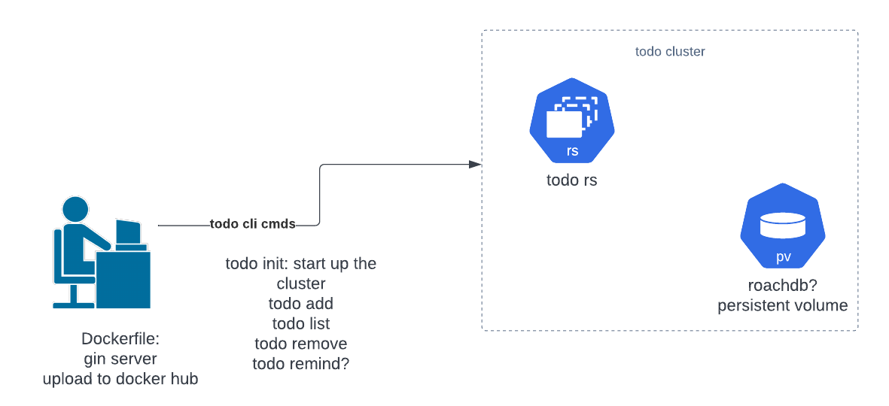

# Simple To Do API server

The goal of this project is to create a simple todo server that can persist data in a k8s cluster as well as run some example deployments as I learn some CI/CD automations. Hoping to have a POC to roll out new changes via deloyments and github actions with this project. For reference, this is an example diagram of what I am initially thinking of:

